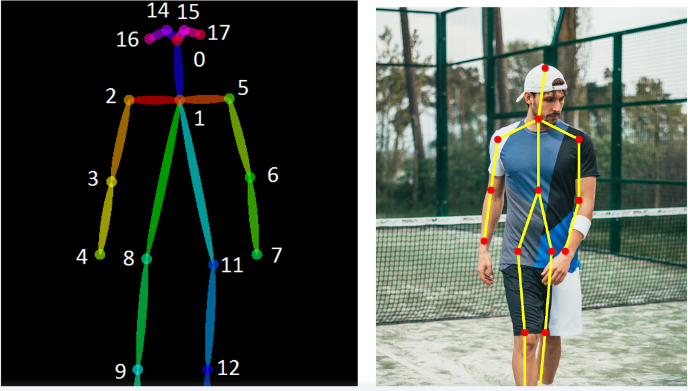

# human-pose-estimation-opencv
<br>

## OpenPose ( skeleton-base 2D,3D kinematic model )
Perform Human Pose Estimation in OpenCV Using OpenPose MobileNet (Pre-Trained Model)
Lightweight OpenPose is a heavily optimized OpenPose implementation to perform real-time inference on CPU with minimal accuracy loss. It detects a skeleton consisting of keypoints and the connections between them to determine human poses for every single person in the image. The pose may include multiple keypoints, including ankles, ears, knees, eyes, hips, nose, wrists, neck, elbows, and shoulders.  
Read more at: https://viso.ai/deep-learning/openpose/

<br>

## KNN Classifier 
Currently , the simple classifier model is used. This project has the labelled data which is stored in data.csv file.
- The labels are 'stand' 'walk' 'squat' 'wave'.

<br>
* This project is detected for single person. For multiple people actions' recognition, there will be next furture research.

# How to use

- Test with webcam

```
python openpose.py
```

```

- Use `--thr` to increase confidence threshold

```
python openpose.py --input image.jpg --thr 0.5
```

# Notes:

